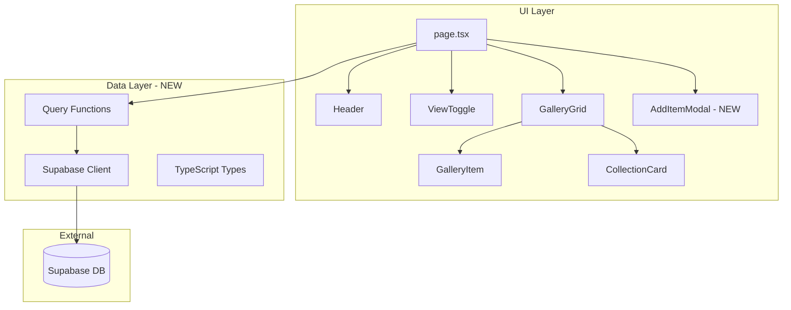

# Internet Garden: Supabase Integration & Add Item Feature

## Background

### Deep Background: The Internet Garden Application

Internet Garden is a personal digital gallery/bookmarking application built with **Next.js 16** and **React 19**. Think of it as a curated mood board where users can collect images, text snippets, links, and PDFs, optionally organizing them into collections.

The application follows a component-based architecture:



**Before this change**, the application used hardcoded mock data embedded directly in `page.tsx`. This worked for prototyping but had obvious limitations:
- No data persistence between sessions
- No way for users to add their own content
- Data was duplicated in source code

### Narrow Background: The Problem Being Solved

The core need was to transform Internet Garden from a static prototype into a real, persistent application where users can:
1. **Read** gallery items and collections from a database
2. **Create** new gallery items through a user interface

This required:
- A database schema to store the data
- Client-side code to communicate with the database
- UI components for adding new items
- Proper loading/error state handling

---

## Intuition

### The Core Idea: From Hardcoded to Dynamic

Imagine you're building a photo album. The original code was like having all photos glued permanently into the album. This change introduces a "photo box" (Supabase database) where photos are stored, and gives you the ability to pick up new photos and add them to your collection.

**Before: Static Data Baked In**
```
┌─────────────────────────────────────┐
│  page.tsx                           │
│  ┌───────────────────────────────┐  │
│  │ const mockData = [            │  │
│  │   { id: '1', type: 'image'... │  │
│  │   { id: '2', type: 'text'...  │  │
│  │   ...                         │  │
│  │ ]                             │  │
│  └───────────────────────────────┘  │
└─────────────────────────────────────┘
```

**After: Dynamic Data from Database**
```
┌─────────────────┐      ┌─────────────────┐      ┌─────────────────┐
│  page.tsx       │      │  Query Layer    │      │  Supabase       │
│                 │ ───► │                 │ ───► │                 │
│  useEffect →    │      │  fetchItems()   │      │  gallery_items  │
│  loadData()     │ ◄─── │  createItem()   │ ◄─── │  collections    │
└─────────────────┘      └─────────────────┘      └─────────────────┘
```

### The Three Pillars

1. **Schema (Database Structure)**: Two tables with a relationship
   ```
   collections ──┐
                 │ 1:N
   gallery_items ◄┘
   ```

2. **Query Layer (Data Access)**: Clean functions that hide Supabase specifics
   ```
   App Code  →  fetchGalleryItems()  →  supabase.from('gallery_items')...
   ```

3. **UI (AddItemModal)**: A form that collects user input and triggers creation

---

## Code Walkthrough

### 1. Database Schema (`scripts/create-tables.sql`)

Defines two tables with proper constraints and security:

```sql
-- Collections: Organizational buckets
CREATE TABLE collections (
  id UUID PRIMARY KEY DEFAULT gen_random_uuid(),
  name TEXT NOT NULL,
  description TEXT,
  created_at TIMESTAMPTZ NOT NULL DEFAULT now(),
  updated_at TIMESTAMPTZ NOT NULL DEFAULT now()
);

-- Gallery Items: The actual content
CREATE TABLE gallery_items (
  id UUID PRIMARY KEY DEFAULT gen_random_uuid(),
  type TEXT NOT NULL CHECK (type IN ('image', 'text', 'link', 'pdf')),
  title TEXT,
  content TEXT NOT NULL,
  collection_id UUID REFERENCES collections(id) ON DELETE SET NULL,
  metadata JSONB,
  ...
);
```

> **Key Design Choice**: `collection_id` uses `ON DELETE SET NULL` rather than `CASCADE`. If a collection is deleted, items remain but become "uncategorized" rather than being deleted.

### 2. Supabase Client Setup (`app/lib/supabase/`)

**TypeScript Types** (`types.ts`): Provides type safety for database operations

```typescript
export interface Database {
  public: {
    Tables: {
      collections: { Row: {...}, Insert: {...}, Update: {...} };
      gallery_items: { Row: {...}, Insert: {...}, Update: {...} };
    };
  };
}
```

**Client** (`client.ts`): Browser-side Supabase instance

```typescript
export const supabase = createClient<Database>(supabaseUrl, supabaseAnonKey);
```

### 3. Query Functions (`app/lib/queries/`)

These functions form the **data access layer**, translating between database rows and application types:

```typescript
// Transform database snake_case to app camelCase
function toGalleryItem(row: GalleryItemRow): GalleryItem {
  return {
    id: row.id,
    type: row.type,
    collectionId: row.collection_id ?? undefined,  // Note the mapping
    // ...
  };
}
```

**CRUD Operations**:
- `fetchCollections()` / `fetchGalleryItems()` - Read all
- `fetchCollectionById()` / `fetchGalleryItemById()` - Read one
- `fetchGalleryItemsByCollection()` - Read filtered
- `createGalleryItem()` - Create new

### 4. Page Component Changes (`app/page.tsx`)

**Removed**: ~70 lines of hardcoded mock data

**Added**: Proper state management with async data loading

```typescript
// State for async data
const [collections, setCollections] = useState<Collection[]>([]);
const [galleryItems, setGalleryItems] = useState<GalleryItemType[]>([]);
const [isLoading, setIsLoading] = useState(true);
const [error, setError] = useState<string | null>(null);

// Load data on mount
useEffect(() => {
  async function loadData() {
    const [collectionsData, itemsData] = await Promise.all([
      fetchCollections(),
      fetchGalleryItems(),
    ]);
    // ...
  }
  loadData();
}, []);
```

**Added**: Loading and error states for better UX

```typescript
if (isLoading) return <Loading />;
if (error) return <ErrorWithRetry />;
```

### 5. AddItemModal Component (`app/components/AddItemModal.tsx`)

A complete form component with:

- **Type selection**: Image, Text, Link, PDF buttons
- **Input validation**: URL validation for non-text types
- **Collection assignment**: Dropdown to assign to existing collections
- **Keyboard accessibility**: Escape key closes modal
- **Loading states**: Disabled submit during creation

```typescript
const handleSubmit = async (e: React.FormEvent) => {
  // Validation
  if (!content.trim()) { setError('Content is required'); return; }
  if (isUrlType && !isValidUrl(content)) { setError('Invalid URL'); return; }
  
  // Create via query function
  await onSubmit({ type, content, title, collectionId, metadata });
  onClose();
};
```

### 6. Dependencies (`package.json`)

Single new dependency:
```json
"@supabase/supabase-js": "^2.93.3"
```

---

## Verification

### How to Test This Change

**Prerequisites:**
1. Supabase project with tables created (run `scripts/create-tables.sql`)
2. Environment variables set:
   ```
   NEXT_PUBLIC_SUPABASE_URL=your-project-url
   NEXT_PUBLIC_SUPABASE_ANON_KEY=your-anon-key
   ```

**Manual QA Checklist:**

1. **Initial Load**
   - [ ] Start the app (`npm run dev`)
   - [ ] Verify loading state appears briefly
   - [ ] Verify items load from database (should see seed data if `seed-data.sql` was run)

2. **Add Item - Happy Path**
   - [ ] Click "+ Add Item" button
   - [ ] Modal opens with focus on type selector
   - [ ] Select "Text" type
   - [ ] Enter content: "Test quote"
   - [ ] Click "Add Item"
   - [ ] Modal closes
   - [ ] New item appears in gallery

3. **Add Item - Validation**
   - [ ] Open modal, leave content empty, submit → Error shown
   - [ ] Select "Image" type, enter "not a url" → Error shown
   - [ ] Enter valid URL → Submits successfully

4. **Modal Behavior**
   - [ ] Press Escape → Modal closes
   - [ ] Click overlay background → Modal closes
   - [ ] Form resets when reopened

5. **Error Handling**
   - [ ] Disconnect network, reload page → Error state with Retry button
   - [ ] Click Retry → Reloads page

---

## Alternatives

### Alternative 1: Server Components with Server Actions

| Pros | Cons |
|------|------|
| No client-side Supabase bundle | Requires page refresh for updates |
| Better security (keys never reach client) | More complex state management |
| Simpler hydration | Can't optimistically update UI |

**Why we didn't choose this**: The app benefits from client-side interactivity. Adding items and seeing them appear immediately provides better UX. Server Components would require more boilerplate for the same user experience.

### Alternative 2: React Query / TanStack Query

| Pros | Cons |
|------|------|
| Built-in caching & invalidation | Additional dependency |
| Optimistic updates out of the box | Learning curve |
| Background refetching | Overkill for current scope |

**Why we didn't choose this**: The current implementation is simple and works. React Query would shine if we add features like real-time sync, pagination, or complex cache invalidation. For now, manual state management is sufficient and avoids dependency bloat.

---

## Quiz

### Question 1: Why does the `collection_id` foreign key use `ON DELETE SET NULL` instead of `ON DELETE CASCADE`?

<details>
<summary>A) To prevent orphan records in the database</summary>
❌ Actually, `SET NULL` creates "orphans" (items without collections). `CASCADE` would prevent them by deleting items when their collection is deleted.
</details>

<details>
<summary>B) To preserve gallery items when their collection is deleted</summary>
✅ Correct! With `SET NULL`, deleting a collection leaves its items intact but uncategorized. This is a deliberate choice to prevent accidental data loss.
</details>

<details>
<summary>C) To improve query performance</summary>
❌ The delete behavior doesn't affect query performance. This is about data integrity and user experience.
</details>

<details>
<summary>D) Because Supabase doesn't support CASCADE</summary>
❌ Supabase (PostgreSQL) fully supports `CASCADE`. This was a deliberate design choice.
</details>

---

### Question 2: What happens if `NEXT_PUBLIC_SUPABASE_URL` is not set?

<details>
<summary>A) The app falls back to mock data</summary>
❌ There's no fallback to mock data. The mock data was completely removed.
</details>

<details>
<summary>B) The app shows a loading spinner forever</summary>
❌ It wouldn't even get to the loading state.
</details>

<details>
<summary>C) An error is thrown at module initialization</summary>
✅ Correct! In `client.ts`, there's an explicit check: `if (!supabaseUrl || !supabaseAnonKey) { throw new Error('Missing Supabase environment variables'); }`. This fails fast at startup.
</details>

<details>
<summary>D) The Supabase client silently fails</summary>
❌ The explicit validation prevents silent failure.
</details>

---

### Question 3: In the `toGalleryItem` transform function, why is `row.collection_id ?? undefined` used instead of just `row.collection_id`?

<details>
<summary>A) To convert empty strings to undefined</summary>
❌ `??` (nullish coalescing) only converts `null` and `undefined`, not empty strings.
</details>

<details>
<summary>B) To satisfy TypeScript's strict null checking</summary>
✅ Correct! The database row type has `collection_id: string | null`, but the application type uses `collectionId?: string` (optional, not nullable). Converting `null` to `undefined` aligns these type systems.
</details>

<details>
<summary>C) To prevent SQL injection</summary>
❌ This is a type transformation in JavaScript, unrelated to SQL injection.
</details>

<details>
<summary>D) To improve runtime performance</summary>
❌ This has no performance impact; it's purely for type compatibility.
</details>

---

### Question 4: Why does `AddItemModal` use a separate `isValidUrl` function instead of relying on the `type="url"` input attribute?

<details>
<summary>A) Browser URL validation is inconsistent across browsers</summary>
❌ While there are some differences, this isn't the primary reason.
</details>

<details>
<summary>B) To provide immediate feedback before form submission</summary>
❌ The validation happens during `handleSubmit`, not on input change.
</details>

<details>
<summary>C) The input's native validation only triggers on form submission, and we want to show a custom error message</summary>
✅ Correct! Native HTML5 validation shows browser-specific messages. By validating manually in `handleSubmit`, we can show consistent, styled error messages in our `{error && <p className={styles.error}>{error}</p>}` element.
</details>

<details>
<summary>D) To support URLs without protocols</summary>
❌ The `isValidUrl` function uses `new URL()` which requires a valid protocol.
</details>

---

### Question 5: What is the purpose of the `Promise.all()` in the data loading effect?

<details>
<summary>A) To ensure collections load before gallery items</summary>
❌ `Promise.all` runs promises concurrently, not sequentially. For sequential execution, you'd use `await` on each call separately.
</details>

<details>
<summary>B) To load collections and gallery items in parallel, reducing total load time</summary>
✅ Correct! Both requests start simultaneously. If each takes 100ms, parallel execution completes in ~100ms vs ~200ms for sequential. This is a common optimization pattern.
</details>

<details>
<summary>C) To retry failed requests automatically</summary>
❌ `Promise.all` doesn't retry. If either promise rejects, the entire `Promise.all` rejects.
</details>

<details>
<summary>D) To cache the results for future use</summary>
❌ `Promise.all` has no caching behavior. It simply waits for all promises to resolve.
</details>
